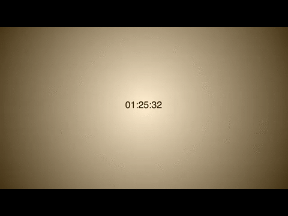

# color-clock

## Objectives

After completing this assignment, you should be able to:

* Demonstrate understanding of functions, loops/array, variadic behavior, `setTimeout()` and `setInterval()`
* Be able to breakdown a simple process of mathematical steps into a series of statements in JS
* Demonstrate Functional Programming methods
* Demonstrate use of DOM APIs (`querySelector()`, `querySelectorAll()`, `addEventListener()`)
* Combine approaches of CSS layout, animation, transitions
* Convert numbers between binary and hex (using `parseInt()` and `Number.toString()`)

## Details

### Instructions

```sh
$ cd <Projects folder>
$ mkdir <projectname>
$ cd <projectname>
$ git init
$ hub create <projectName>

```

### Requirements

* A visible, up-to-date `gh-pages` branch must be on Github. If you are pushing to Divshot / Heroku / AWS / etc, that is also fine... as long as we can load the page on the web!

## Normal Mode

### Stage I: 

Just recreate this static page: 



* That is, format a Date() object and put it on the page using this layout.
* Add hover functionality to show the hex color of the gradient instead of the time.

### Stage II: 

Bring your color clock to life: 


* Make the clock "tick" and change the gradient in tandem.
* Add the horizontal line that shows the progress of each minute. 

HAVE FUN!
