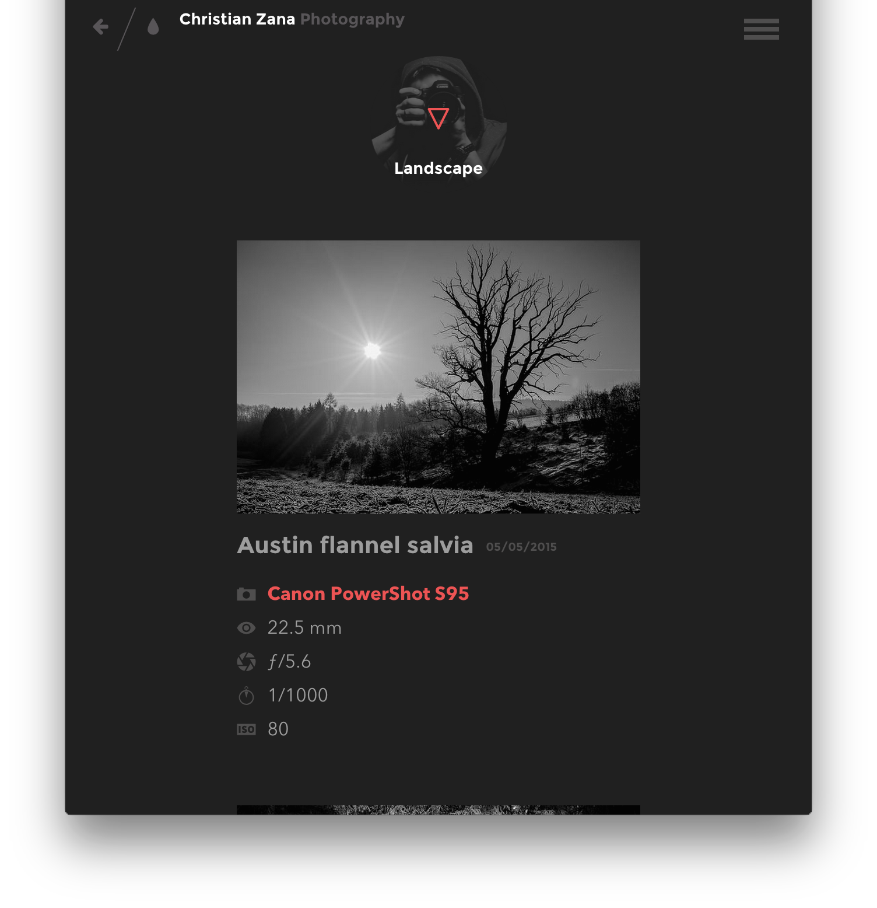
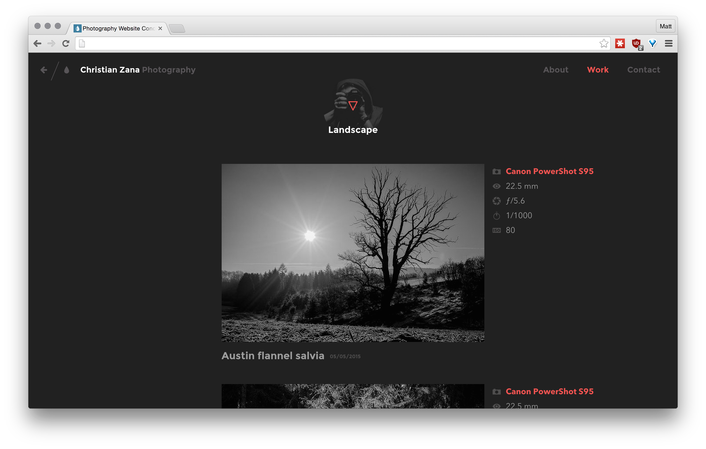
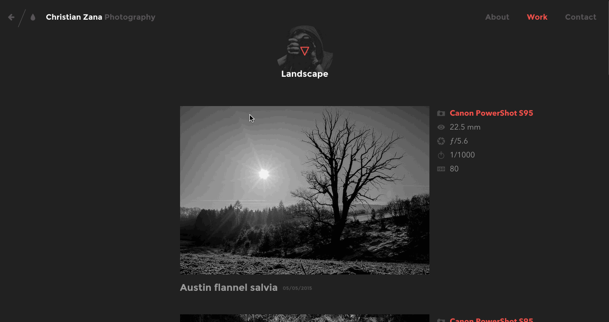

# html-design-challenge-photography-site

## Description

This is a challenge to take a flat set of images, and recreate the design in HTML/CSS.

## Objectives

### Learning Objectives

After completing this assignment, you should be able to:

- demonstrate the 4 different methods of layout (inline-block, floats, position/absolute, and flexbox)
- have a strong grasp of various HTML elements and their default styles
- have a strong grasp of CSS selectors, identifiers, combinators, pseudo-classes, and pseudo-elements
- understand the different CSS types and keywords, especially colors and dimensional values
- have a strong grasp of various CSS properties and their values

### Performance Objectives

After completing this assignment, you be able to effectively turn a flat design image into a structured, semantic, and responsive webpage in HTML and CSS.
## Details

### Deliverables

* A repo containing at least:
    * An `index.html`
    * A scss, css, or styles folder
        * some css or scss files
    * An images folder with any images needed

### Requirements

* Your HTML and CSS should be valid.
    - https://validator.w3.org/
    - http://csslint.net/

## Normal Mode

Implement the HTML and CSS needed for this design:

