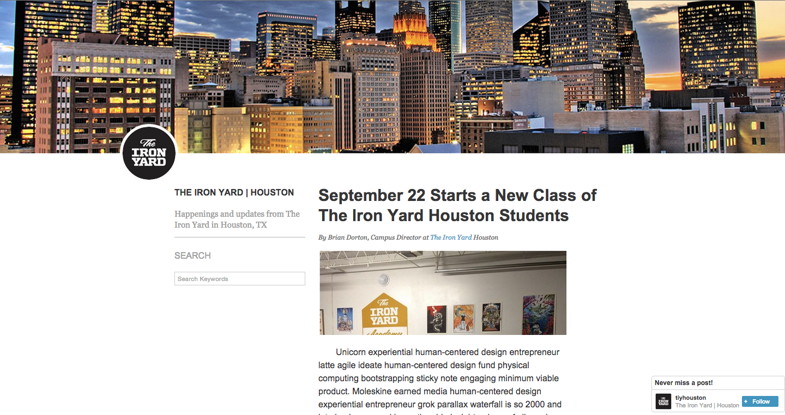

# html-intro-1

## Description

This assignment serves to reinforce HTML, CSS, keyboard shortcuts, working with Sublime, and some familiarity with the OS X Terminal.

## Objectives

- familiarize yourself with all the HTML tags
- familiarize yourself with a lot of CSS properties
- familiarize yourself with navigating through the terminal, and opening workspaces with a code editor (such as Sublime Text, Atom, vim, etc..)
- reinforce concepts of layout and `display` types
- familiarize yourself with Chrome's Developer Tools and keyboard shortcuts

### Learning Objectives

After completing this assignment, you should be able to create a blog layout from scratch.

### Performance Objectives

After completing this assignment, you should be able to effectively:

- navigate the folder structure in the terminal
- open workspaces and create files with Sublime Text, Atom, vim, etc...
- generate boilerplate HTML code in Sublime Text
- find and use resources (like Lorem Ipsum and GIFs)
- create simple, single column layouts
- debug HTML and CSS with Chrome Developer Tools

## Details

### Deliverables

- a git repo containing:
    - `index.html`
    - `styles` folder
        - `style.css`
    - `images` folder
        - with any images you used with your design

### Requirements

- a working, publicly visible website with a public URL (i.e. on Github pages, with DivShot, on Heroku, etc)

## Normal Mode

Recreate the following layout in HTML and CSS:

## Notes

http://learnlayout.com/ outlines a number of things, however here are some general takeaways from the site (and lecture):

1. There is something called the Box Model. Every element has a Box with

    1. width and height (content),
    2. padding,
    3. border,
    4. and margin.

    Here is a visual description of the Box Model:

    

- **EVERY** element has a default style, given to it by a default stylesheet. **EVERY** browser has a default stylesheet.
- There are a few main CSS attributes that influence layout:

    1. position
    - display
    - width and height
    - padding
    - border
    - margin

    Everything else in CSS simply colors, changes fonts, font sizes, background images, etc.

- All elements have a `position`, which is one of the four following values:

    1. `static`
    2. `relative`
    3. `absolute`
    4. `fixed`

    Any element with `static` or `relative` is considered having **LAYOUT**. This means they affect where other items are rendered. The other `position` values create a new layer. If an element is either of these, it is rendered above (on a new, 3d layer) and may cover up text or elements beneath it.

- All elements have a `display`, which is one of the following values:

    1. `inline`
    - `inline-block`
    - `block`
    - `table`
    - `inline-table`
    - `table-cell`
    - `table-caption`
    - `table-column`
    - `table-row`
    - `flex`
    - `inline-flex`

    The most common `display` types are `inline`, `inline-block`, and `block`. We will only be focusing on these (for now).

    - `inline` elements flow with text. They typically have only text in them that gives them width and height. Typical `inline` elements: `span`, `strong`, `em`, `i`, `b`. The default `display` type for `img` tags is also `inline`.
    - `block` elements create vertical sections. Anything before them in the HTML is rendered on top, anything after them in the HTML is rendered beneath.
    - `inline-block` has the same layout properties of `inline`, however it can have padding, border, and margin.

## Additional Resources

- http://learnlayout.com/
- http://meettheipsums.com/
- Mozilla Developer Network: https://developer.mozilla.org/en-US/
- List of HTML tags: https://developer.mozilla.org/en-US/docs/Web/HTML/Element
- List of HTML attributes: https://developer.mozilla.org/en-US/docs/Web/HTML/Attributes
- All the CSS properties! https://developer.mozilla.org/en-US/docs/Web/CSS/Reference
- You need GIFs, so get 'em here: http://giphy.com/
