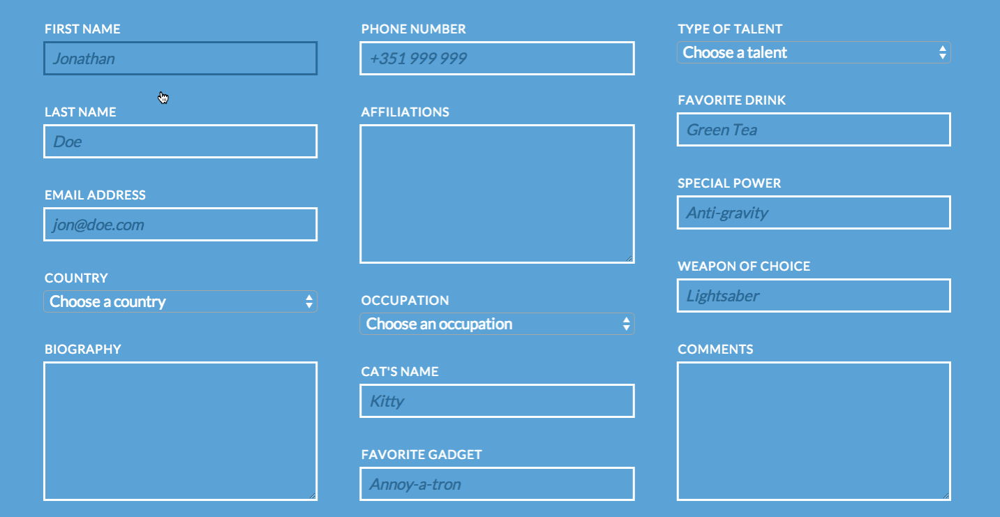

# html-intro-2-responsive-forms

## Description

This assignment serves to reinforce HTML forms and relevant tags, form attributes, CSS layouts and techniques, as well as transitions.

## Objectives

- familiarize yourself with all the HTML form tags and their attributes
- familiarize yourself with a CSS layout techniques (columns, structure, transitions, pseudo-selectors)
- reinforce concepts of layout and `display` types

### Learning Objectives

After completing this assignment, you should be able to create a responsive layout in HTML and CSS from scratch.

### Performance Objectives

After completing this assignment, you should be able to effectively:

- navigate the folder structure in the terminal
- open workspaces and create files with Sublime Text, Atom, vim, etc...
- generate boilerplate HTML code in Sublime Text
- find and use resources (like Lorem Ipsum and GIFs)
- debug HTML and CSS with Chrome Developer Tools
- create multi-column layouts, and customize responsive forms and styles

## Details

### Deliverables

- a git repo containing:
    - `index.html`
    - `styles` folder
        - `style.css`
    - `images` folder
        - with any images you used with your design

### Requirements

- a working, publicly visible website with a public URL (i.e. on Github pages, with DivShot, on Heroku, etc)

## Normal Mode

Recreate the following layout in HTML and CSS:

## Notes

Notes go here...

## Additional Resources

- http://learnlayout.com/
- List of HTML tags: https://developer.mozilla.org/en-US/docs/Web/HTML/Element
- List of HTML attributes: https://developer.mozilla.org/en-US/docs/Web/HTML/Attributes
- All the CSS properties! https://developer.mozilla.org/en-US/docs/Web/CSS/Reference
