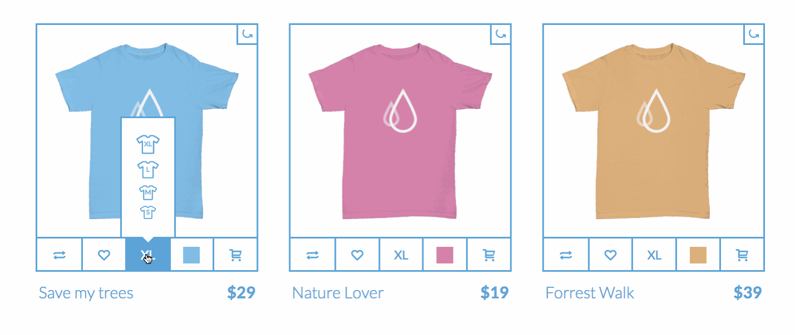

# html-intro-3-tshirts

## Description

This assignment serves to reinforce responsive layouts, exercise positioning with CSS, and demonstrate uses of opacity/transitions/keyframes.

## Objectives

- exercise control of CSS display types, positioning, animations
- reinforce concepts of layout and `display` types

### Learning Objectives

After completing this assignment, you should be able to create a responsive layout in HTML and CSS from scratch.

### Performance Objectives

After completing this assignment, you should be able to effectively:

- create complex, multi-column layouts, with a variety of different methods; combining multiple approaches to achieve truly creative interface potential

## Details

### Deliverables

- a git repo containing:
    - `index.html`
    - stylesheets (`scss/`, `css/`, and `dist/` folders)
    - `images` folder
        - with any images you used with your design

### Requirements

- a working, publicly visible website with a public URL (i.e. on Github pages, with DivShot, on Heroku, etc)

## Normal Mode

Recreate the following layout in HTML and CSS:

## Notes

Notes go here...

## Additional Resources

- http://learnlayout.com/
- List of HTML tags: https://developer.mozilla.org/en-US/docs/Web/HTML/Element
- List of HTML attributes: https://developer.mozilla.org/en-US/docs/Web/HTML/Attributes
- All the CSS properties! https://developer.mozilla.org/en-US/docs/Web/CSS/Reference
