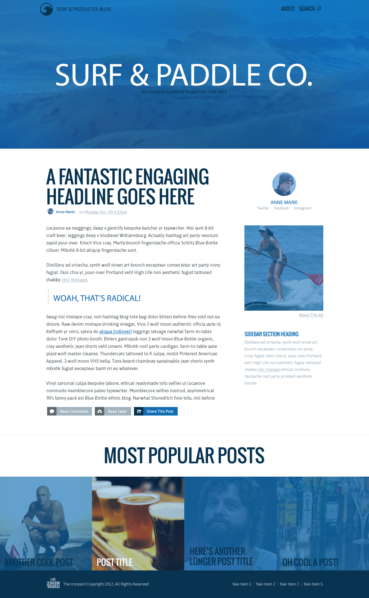

# html-intro-surf-paddle

## Description
As a developer on the web, you will sometimes be tasked with creating an html page simply from an image file.  In this assignment, you&#x27;ll be taking an image and turning it into a functioning website.

## Objectives

### Learning Objectives

After completing this assignment, you should…

Upon completion of this assignment, you should:

* Understand the propery use and function of html tags.
* Understand and able to leverage the many css properties to style content.
* Use CSS to create layout for the HTML page.

### Performance Objectives

After completing this assignment, you be able to effectively use

* Use sectioning html tags
* Effectively utilize some common css layout strategies (float or inline-block)
* Able to leverage and understand the use of `absolute` vs `relative` in context of positioning.
* The menu items need to also have differing states based on a hover, and although not articulated in the provided image, they need to be styled.

## Details

### Deliverables

* A repo containing at least:
  * `index.html`
  * 'styles.css'
  * 'images/'

### Requirements

* The resulting web page cannot just be an image of the assignment centered on the page :)

## Normal Mode

Using the image located `assets/surf-and-paddle.png`, create a html document using html and css to look like below, but be a function website:

## Hard Mode

Complete Normal Mode then make the website fully responsive and adhering to this [responsive wireframe](assets/surf-and-paddle-responsive.pdf).

## Additional Resources

* Read [Learn Layout](http://learnlayout.com/)
* Read [HTML tag content categories](https://developer.mozilla.org/en-US/docs/Web/Guide/HTML/Content_categories)
