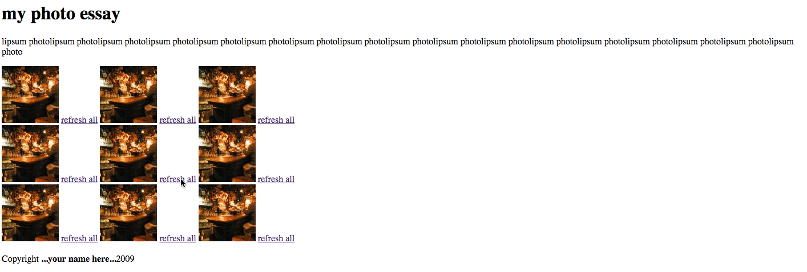
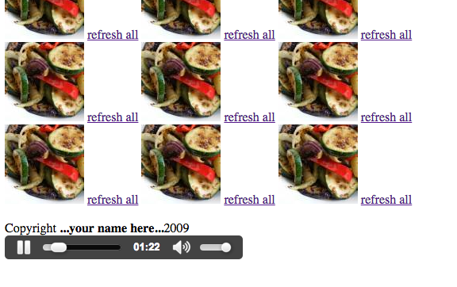

#Photo Grid

###Objectives:

To become familiar with:
  - The default properties of HTML elements
  - The differences between the `block` and `inline` values of the `display` property
  - The art of nesting and organizing HTML elements

###The task:

Recreate the page shown in the gif below.
* * * 

***
###Notes and Requirements: 

  - The images must be 100px X 100px (note: you can specify the size within the lorempixel url, i.e. http://lorempixel.com/100/100/).
  - The image grid must contain no more than 3 images per row, with at least 3 rows. 
  - You may NOT use ` ` tags.
  - Clicking the link next to an image should refresh the page, replacing all images in the grid with new images.
  - The *content* of the heading, intro, copyright, etc., doesn't matter (obviously I've used placeholders), but the layout and formatting do. Even the bolding of your name at the bottom.
  
###Submission:

  - You must submit a link to a working/mock web site through the [tiy-classroom app](https://tiy-classroom.herokuapp.com).
  - I recommend using [codepen](https://codepen.io).

###Adventure Mode: 

  - Add an audio player to your photo grid, so the user can play a song or a famous speech (why not?) while they look at your fake pictures. 
  - The audio player should appear in its own row, before the copyright line, like this:

***

***
