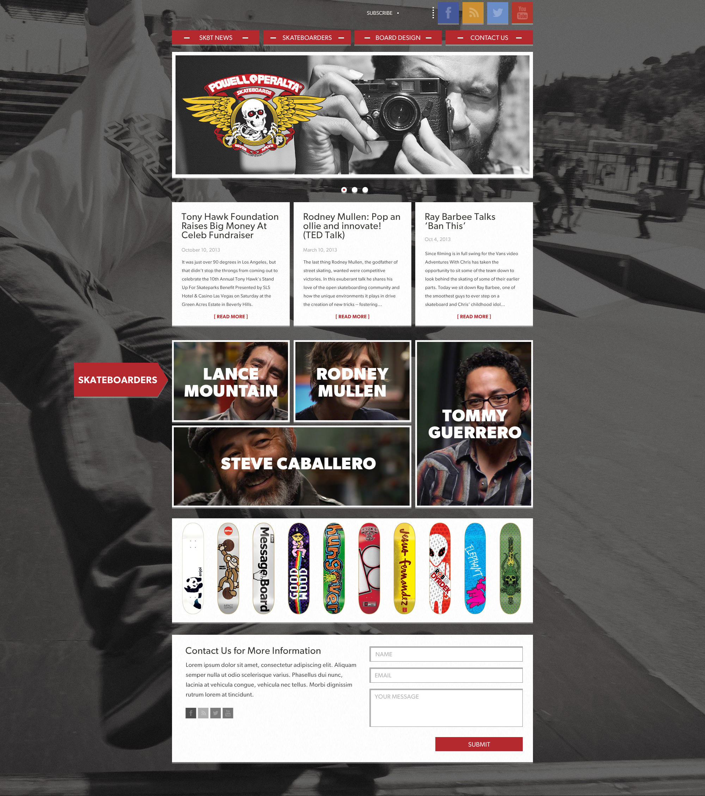

# Sk8 Site - Wireframe => HTML

## Description
Without fail, a front-end developer will need to convert a wireframe into a fully functioning website, and responsive at that.

For this assignment, you'll be creating this below wireframe and turning into a site that not only renders well from a normal desktop size, but also transitions and is very usable on smaller viewports.

## Objectives

### Learning Objectives

After completing this assignment, you should…

* Have solid understanding of HTML/CSS/SASS
* Understand principles of RWD and be able to effectively execute a solid flow of content from desktop to mobile.
* Be able to leverage developer tools to test on mobile devices.

### Performance Objectives

After completing this assignment, you be able to effectively use

* From a high fidelity wireframe, you should be able to, with a high degree of accuracy, create an html prototype of said design.
* @media queries
* SASS
* HTML
* manually compile SASS => CSS

## Details

### Deliverables

* A repo containing at least:
  * `index.html`
  * `scss/<sass files>.scss`
  * `css/<css files>.css`

## Normal Mode

* Create a web page from the given Powell Peralta wireframe.
* The finished prototype must be responsive and adjust in a usable way to mobile devices.
* SASS will be written and compiled to CSS

## Hard Mode

Do everything just like normal mode, but also add an image slider to the header and the skateboard section and form validation to the contact form at the bottom page.
