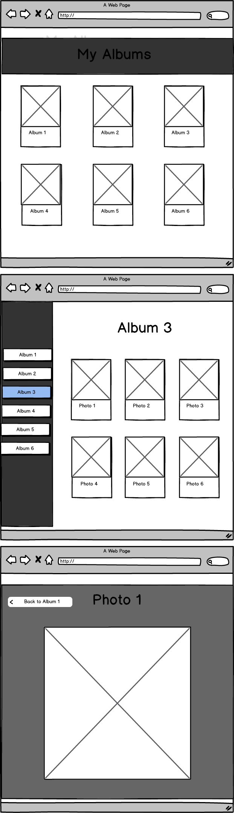

# Photo albums

## Description
You're going to create a gallery application which will allow the user to view their albums as well as the individual photos contained within, as a single page application (SPA).

## Wireframes

## Objectives

### Learning Objectives

After completing this assignment, you should…

* Understand what is the Document Object Model and how it relates to javascript.
* Understand DOM traversal and manipulation utilizing jQuery or native DOM api
* Basic understanding of events.

### Performance Objectives

After completing this assignment, you be able to effectively use

* Use jQuery to traverse up and down the DOM
* Effectively find the correct elements to manipulate, hide, and show
* Basic event binding using jQuery shorthand methods

## Details

### Deliverables

* A repo containing:
  * `index.html`
  * `bower_components/jquery/`
  * `bower.json`
  * `photo-album.js`

### Requirements

* `index.html` is the only page that exists for this assignment
* Must have a minimum of 6 photo albums
* Each photo album must contain at least 3 photos
* Based on the wireframes, you have 3 views.
  - Main Gallery of Albums view
  - Contents of Album view
  - Photo detail view
* jQuery will be used for dom manipulation and traversal
* The jQuery library must be loaded via bower and be included as a dependency via  `bower.json`

## Normal Mode

To complete this assignment:

- The gallery application must be a single web page
- The views must match the wireframe layouts, respectively

## Hard Mode

Do everything in normal mode, but also:

- On the photo detail, allow to navigate to other photos in the same album via a click to the left or right of the photo the user is currently viewing.
