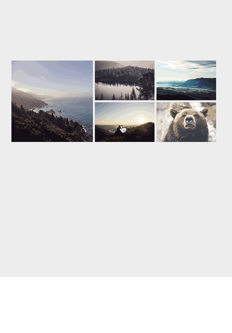
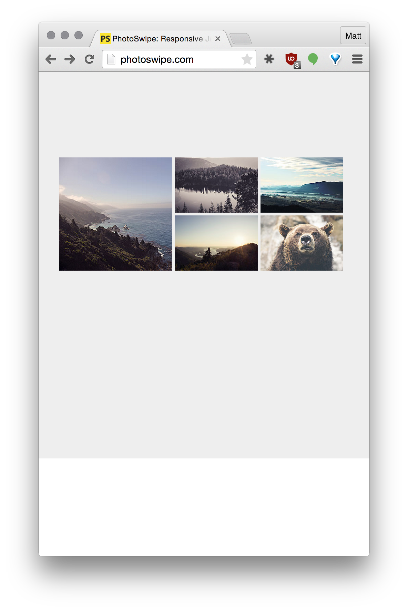
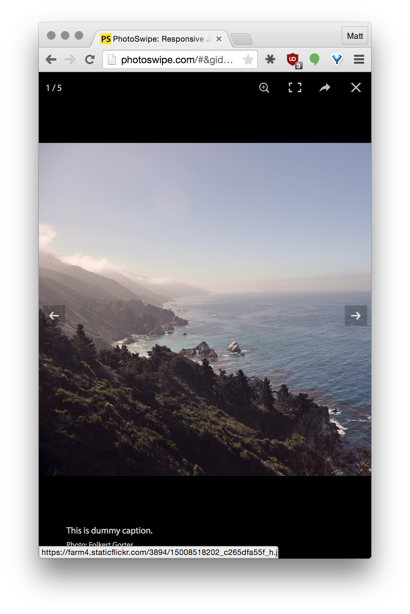
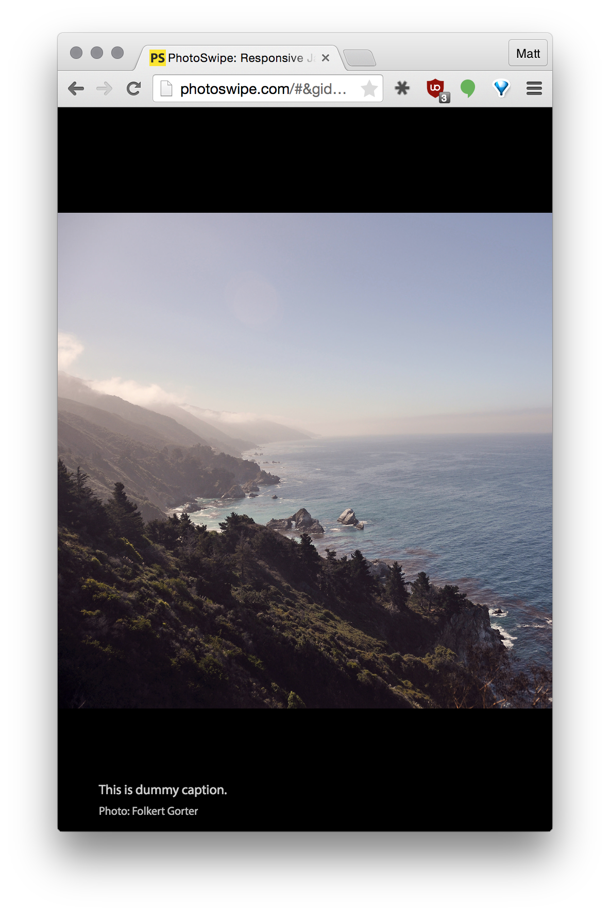

# photoswipe

## Objectives

After completing this assignment, you should be able to:

* Demonstrate understanding of functions, loops/array, variadic behavior, and all the JS things!
* Demonstrate mastery of the build process and loading/generating/linking CSS and JS to a webpage
* Demonstrate use of CSS and layout, color, and ability to translate a design into working HTML/CSS
* Demonstrate use of DOM APIs, DOM events, and manipulating DOM elements with JS

## Details

### Instructions

```sh
# cd into GH project folder
# then mkdir <projectName>
# then git init
# then setup your project files (i.e. download package.json and run `npm install`)
```

**You are required** to push your website up to a publicly visible URL like `gh-pages`, Heroku, DivShot, etc.

### Requirements

* A publicly visible site
* All features and animations created to spec, as discussed in class

## Normal Mode

Recreate these designs in HTML, CSS, and JS. Here is an animated version:



And some various stills:





