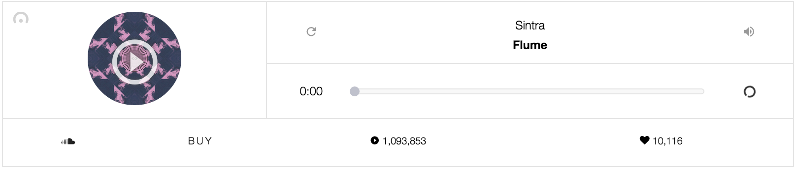

# Soundcloud

## Objectives

After completing this assignment, you should be able to:

* Demonstrate understanding of functions, loops/array, variadic behavior
* Be able to breakdown a simple process of mathematical steps into a series of statements in JS
* Demonstrate Functional Programming methods
* Demonstrate use of Promises and AJAX methods
* Demonstrate ability to update DOM elements and their attributes/innerHTML via JS
* Demonstrate uderstanding of the concepts of MVC, such as Backbone Models, Views and Routers
* Demonstrate knowledge of `new`, constructors, and the prototype chain
* Demonstrate knowledge of composing views and handling events with React, Backbone, Ember, or Angular
* Understand CSS 3D transforms, CSS animations, and form skinning
* Understand the Soundcloud SDK and playing audio

## Setup

```sh
# cd into GH project folder
# then mkdir <projectName>
# then git init
# then hub create <projectName> to create the repo on Github, too
# then setup your project files (i.e. download package.json and run `npm install`)
```

## Deliverables

* A publicly visible website (gh-pages, divshot, heroku, etc...)

# Normal Mode

Write a view layer (i.e. React Component, Backbone View, Angular Directive, Ember View, etc) that handles events and controls the player for the Soundcloud SDK (https://developers.soundcloud.com/docs/api/sdks).

- The Soundcloud SDK will provide you access to searching for and streaming a Soundcloud song/sound.
- The view will provide the UI and event handling with the DOM.

For a quick tutorial on using the Souncdloud API, see: http://www.codecademy.com/en/tracks/soundcloud

Visual Inspiration:




- The view (i.e. React Components) should render:
    - The author
    - The song/track name
    - A replay button
    - A volume button
    - A cropped/minified album cover image
    - A counter for the number of times this track has been played on Soundcloud
    - A counter for the number of "loves" this track has received
    - A trackbar and progress for the song (elapsed time)
- When a song is streaming, the play button is a "pause" button.

## Hard Mode

In addition to Normal Mode:

- When a song is streaming, the trackbar and progress update with the elapsed time as a song plays
- If a user drags the progress indicator, the track will "scrub" with the user's interaction (i.e. dragging the indicator left will scrub backwards in time)

## Nightmare Mode

In addition to Hard Mode:

- Put a searchbar at the top of the screen, and as a user types in song names, render multiple search results in a grid beneath the search form.
