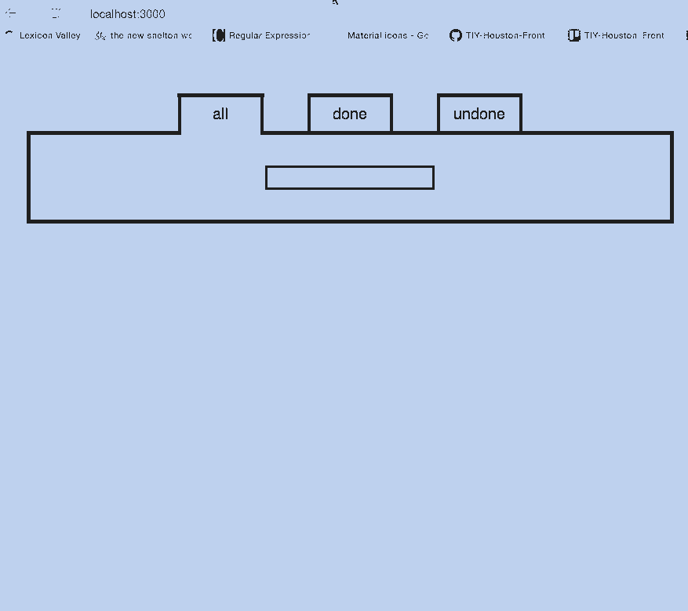
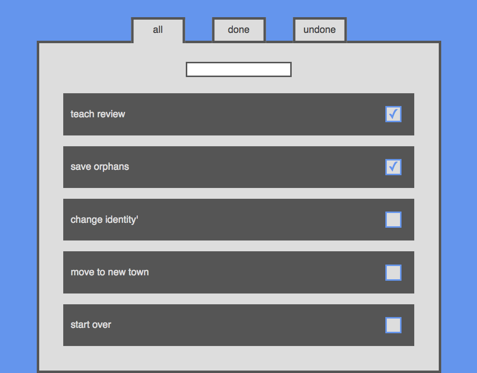

# Todo List

## Normal Mode

Design a model-view architecture (required view: React; suggested model/collection: Backbone) for a todo-list app. A user should be able to:

  - add a new task and see it appear in a list of pending tasks. 
  - remove a task from the list.
  - add additional information about a task, such as its description and due date. 

## Hard Mode

Instead of simply removing a completed task, a user should be able to toggle that task's completion status. Additionally, your app should have three routes/views: all tasks, done tasks, and undone tasks, where each view shows only its designated subset of tasks. See the gif below for an example. Please note that in real life, checkmarks appear in every clicked box -- they just don't show up in the darn gif.  

