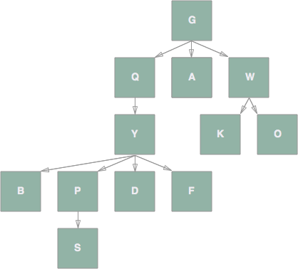

# Tree Practice

## Description
Answer some questions about tree data structures to practice terminology and solidify your understanding of how they work.

## Objectives

### Learning Objectives

After completing this assignment, you should…

* Understand the following definitions
	* node
	* root
	* parent
	* child
	* sibling
	* descendent
	* leaf
	* edge
	* path

### Performance Objectives

After completing this assignment, you be able to effectively use

* tree data structures

## Details

### Deliverables

* A repo containing at least:
  * `answers.txt`

### Requirements

* Your answers should be in the format:
	> *question#*) *answer*

	> *question#*) *answer*

	> *question#*) *answer*
	
	For example:
	> 1) 7

	> 2) node

	Your homework will be graded automatically, so if it is not in this format it will be marked wrong.
 * If the answer to a question involves multiple nodes, write the answer using capital letters with no spaces or commas separating them.

## Normal Mode
Answer the following questions about trees based on the following diagram:

###### Question 1:
What are the leaf nodes in alphabetical order (no commas or spaces between them)?

###### Question 2:
How many children does node `Y` have?

###### Question 3:
What is the name of the root node?

###### Question 4:
How many children of the root node are leaves?

###### Question 5:
What is the name of `F`'s parent?

###### Question 6:
How many descendents does `Q` have?

###### Question 7:
What are `B`'s ancestors starting with it's parent and working your way up (no commas or spaces between them)?

###### Question 8:
How many siblings does the root node have?

###### Question 9:
Who are `D`'s siblings, in alphabetical order (no commas or spaces between them)?

###### Question 10:
How many edges are between `Q` and `P`.

###### Question 11:
What are the nodes on the path from `G` to `S` (including `G` and `S`. No commas, spaces or / between them)

## Notes

This assignment is as much about attention to detail and following instructions as it is about trees specifically. Follow the directions as closely as possible. If you have questions don't hesitate to ask me or the TA.

## Additional Resources

* [Class Notes on Trees](https://github.com/TIY-Austin-Front-End-Engineering/Curriculum/tree/master/trees)
